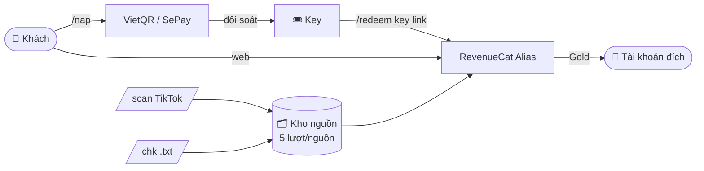

# 🚀 Locket Gold — Bot & Web Store

<div align="center">


**Bán key Locket Gold qua Telegram + web store, kích hoạt bằng cơ chế RevenueCat Alias.**

</div>

---

## ✨ Cơ chế hoạt động

Hệ thống dùng **kho nguồn Gold** (source pool). Mỗi nguồn là một tài khoản
Locket đang có Gold; khi kích hoạt, hệ thống alias subscriber của nguồn sang
UID đích, chuyển Gold sang tài khoản khách. Mỗi nguồn dùng tối đa **5 lượt**
(trần alias của RevenueCat là 50, giữ biên an toàn).

* **Key theo gói**: `1m` ưu tiên nguồn còn 25-30 ngày, `1y` ưu tiên nguồn còn 200-360 ngày.
* **Key đa lượt**: admin có thể tạo key dùng nhiều lần.
* **Hoàn lượt tự động**: kích hoạt lỗi (hết nguồn, chặn IP, alias limit, nick đã có Gold) → hoàn lại lượt key.
* **Tự chăm kho nguồn**: nguồn hết hạn / dưới 10 ngày / chạm limit bị loại tự động.
* **Không cần DNS**: cơ chế alias không cần chặn revenuecat.

---

## 🎮 Lệnh bot

### Người dùng

| Lệnh | Mô tả |
| :--- | :--- |
| `/start`, `/menu` | Menu chính + bàn phím nhanh |
| `/nap` | Mua key **Gói Vĩnh Viễn** (VietQR qua SePay) |
| `/sodu` | Key còn lại, lịch sử mua & kích hoạt |
| `/redeem <key> <link_locket>` | **Kích hoạt Gold** (ví dụ: `/redeem LK-GOLD-89ABCX https://locket.cam/username`) |
| `/check <user_hoặc_link>` | Kiểm tra Gold + ngày hết hạn |
| `/chk` (kèm file `.txt`) | Kiểm tra hàng loạt, tự thêm tài khoản đủ điều kiện vào kho nguồn |
| `/scan <link_tiktok>` | Quét toàn bộ bình luận TikTok lấy link Locket rồi tự kiểm tra |
| `/setlang`, `/help` | Đổi ngôn ngữ, trợ giúp |

### Admin

| Lệnh | Mô tả |
| :--- | :--- |
| `/genkey <số_lượt> [1m\|1y]` | Tạo key thủ công (ví dụ `/genkey 5 1y`) |
| `/set <link_nguồn>` | Xem kho nguồn hoặc thêm nguồn mới |
| `/checksources [quick]` | Kiểm tra & dọn kho nguồn (mặc định thử alias để phát hiện trần limit; `quick` = chỉ check trạng thái) |
| `/stats` | Thống kê hệ thống |
| `/noti <msg>` | Thông báo tới toàn bộ user |
| `/setdonate`, `/setvideo` | Ảnh thành công, video hướng dẫn |

---

## 🌐 Web Store

`web_store.py` chạy song song với bot, dùng chung database:

* **Trang bán** (`/`): gói **Vĩnh Viễn** duy nhất, kiểm tra tài khoản Locket,
  tạo đơn VietQR, **kích hoạt key trực tiếp trên web**, và **kích hoạt lại
  miễn phí** khi Gold rớt (cho tài khoản đã từng kích hoạt).
* **Trang đơn** (`/order/<id>`): QR + trạng thái thanh toán + key giao tự động
  + form kích hoạt ngay.
* **Kiểm tra key** (`/verify`): trạng thái, gói và số lượt còn lại.
* **Admin** (`/admin`): doanh thu, đơn hàng, tạo key, và **quản lý kho nguồn
  Gold** (thêm/xóa/dọn nguồn) ngay trên web.

---

## 🛠️ Cài đặt

```bash
git clone git@github.com:zero3041/Locket-Gold.git
cd Locket-Gold
cp .env.example .env      # điền các biến bên dưới
./run.sh                  # tạo venv, cài deps, chạy web store + bot
```

Chạy nền (tắt terminal vẫn chạy):

```bash
nohup ./venv/bin/python3 -u web_store.py >> web_store.out 2>&1 &
nohup ./venv/bin/python3 -u main.py >> bot.out 2>&1 &
```

---

## ⚙️ Cấu hình

Cấu hình đọc từ `.env` (biến môi trường của process được ưu tiên).

| Biến | Ý nghĩa |
| :--- | :--- |
| `BOT_TOKEN` | Token bot Telegram (BotFather) |
| `ADMIN_ID` | Telegram user ID của admin |
| `REVENUECAT_APP_KEY` | RevenueCat secret key — dùng cho check status và alias |
| `SEPAY_API_TOKEN` | SePay API token để đối soát chuyển khoản |
| `BANK_BIN`, `BANK_ACCOUNT`, `BANK_NAME`, `BANK_OWNER` | Thông tin nhận tiền VietQR |
| `CDK_UNIT_PRICE` | Giá key gói Vĩnh Viễn (VND) |
| `CDK_UNIT_PRICE_1Y` | Giá key 1 năm cho admin (`/genkey 1y`), tùy chọn |
| `FREE_REACTIVATE_COOLDOWN_MINUTES` | Chờ giữa 2 lần kích hoạt lại miễn phí (mặc định 30) |
| `FREE_REACTIVATE_DAILY_MAX` | Số lần kích hoạt lại miễn phí / 1 khách / ngày (mặc định 5) |
| `CDK_SECRET` | Secret ≥32 ký tự để sinh key an toàn |
| `GOLD_MIN_SOURCE_DAYS` | Ngưỡng ngày tối thiểu giữ nguồn (mặc định 10) |
| `CHK_PROXY_URL` | Proxy riêng cho `/chk` (tùy chọn) |
| `WEB_HOST`, `WEB_PORT` | Địa chỉ web store |
| `WEB_ADMIN_USER`, `WEB_ADMIN_PASSWORD_HASH` | Tài khoản admin web |
| `WEB_SESSION_SECRET` | Khóa ký session web (mặc định dùng `CDK_SECRET`) |

Tạo secret:

```bash
python -c "import secrets; print(secrets.token_urlsafe(48))"
```

### Kho nguồn

Kho nguồn lưu trong SQLite (`gold_sources`). Lần đầu chạy, nếu có file
`current_source.txt` ở thư mục gốc, bot/web sẽ tự import:

```
# DANH SÁCH NGUỒN LOCKET GOLD
# FORMAT: STT | USERNAME | SỐ LẦN ĐÃ KÍCH (TỐI ĐA 5 LẦN) | EXPIRES
1 | username | 0 | expires: 2027-08-02 20:39:51 (còn 314 ngày)
```

Thêm nguồn nhanh: `/set https://locket.cam/username` (bot) hoặc trang
**Nguồn Gold** trong admin web.

---

## 📊 Kiến trúc



---

## 🧪 Tests

```bash
./venv/bin/python3 -m unittest discover -s tests
```

---

## ⚠️ Disclaimer

> **Dự án chỉ dành cho mục đích học tập và nghiên cứu.** Tác giả không chịu
> trách nhiệm cho bất kỳ hành vi sử dụng sai mục đích nào. "Locket Widget" và
> "RevenueCat" là thương hiệu của chủ sở hữu tương ứng.

<div align="center">

Maintained by [zero3041](https://github.com/zero3041)

</div>
