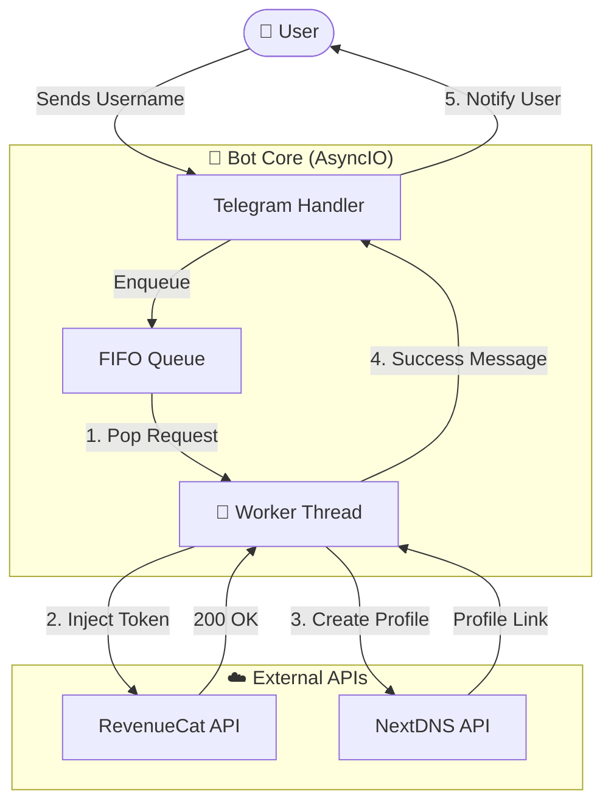

# 🚀 Locket Gold Activator Bot (Professional Edition)

<div align="center">

[](https://python.org)
[](https://core.telegram.org/bots)
[](https://docs.python.org/3/library/asyncio.html)
[](LICENSE)
[]()

**The most advanced, high-performance Telegram Bot for automating Locket Gold activation.**  
*Built with speed, security, and scalability in mind.*

[Why Choose This Bot?](#-why-choose-locket-gold-activator-bot) • [Features](#-key-features) • [Installation](#-installation) • [Configuration](#-configuration)

</div>

---

## 💎 Why Choose Locket Gold Activator Bot?

Unlike other basic scripts or tools, this bot is engineered as a **production-grade system**. It solves the common problems of slowness, API bans, and revocations.

| Feature | This Bot 🚀 | Standard Scripts ❌ |
| :--- | :--- | :--- |
| **Performance** | **Zero-Lag Async Core**. Handles thousands of users without freezing. | Single-threaded. Freezes while processing one user. |
| **Reliability** | **Round-Robin Token Rotation**. Distributes load to prevent bans. | Uses 1 token until it dies or gets rate-limited. |
| **Safety** | **Smart Anti-Revoke**. Auto-generates NextDNS profiles to block validation servers. | No protection. Gold disappears after a few hours/days. |
| **User Experience** | **Real-time Queue Updates**. Users know their exact position (`#1`, `#2`...). | Silent failure. Users don't know if it's working. |
| **Architecture** | **Worker Pool**. Scalable system (add 1 or 100 workers easily). | Simple loop. Cannot scale with demand. |

---

## 🌟 Key Features

### ⚡ **High-Performance Core**
*   **Fully Asynchronous**: Powered by `aiohttp` and `asyncio` for non-blocking I/O. The bot remains responsive to commands even under heavy load.
*   **Worker Pool System**: Configurable number of concurrent workers (`NUM_WORKERS`) to parallelize request processing.

### 🛡️ **Advanced Security**
*   **NextDNS Integration**: Automatically creates a unique DNS profile for each user that blocks `revenuecat.com`, ensuring the Gold subscription sticks.
*   **Strict Cooldowns**: Enforces a 45-second cooldown per token usage to mimic human behavior and avoid detection.

### 🤖 **Smart Automation**
*   **Auto-Resolution**: Just paste a Locket username or link; the bot handles UID resolution automatically.
*   **Queue Management**: FIFO (First-In-First-Out) queue system with live status updates to prevent API flooding.
*   **Admin Dashboard**: Powerful `/stats` command to monitor queue size, active workers, and success rates in real-time.

---

## 🛠️ Installation

### Prerequisites
*   Python 3.9+
*   Telegram Bot Token via [@BotFather](https://t.me/BotFather)
*   NextDNS API Key via [NextDNS Developer](https://my.nextdns.io/account)

### Automated Setup
We provide a **one-click setup script** that handles virtual environments and dependencies.

```bash
# 1. Clone the repository
git clone git@github.com:zero3041/Locket-Gold.git
cd Locket-Gold

# 2. Run the setup script
chmod +x run.sh
./run.sh
```

---

## ⚙️ Configuration

Sensitive payment/CDK settings are read from environment variables. The bot
loads the local ignored `.env` file automatically, while process-level
environment variables take precedence. Copy `.env.example` as a starting point;
`/muacdk` stays fail-closed until every required payment value is valid.

Required for CDK sales:

| Variable | Meaning |
| :--- | :--- |
| `SEPAY_API_TOKEN` | SePay API v2 Bearer token |
| `BANK_BIN`, `BANK_ACCOUNT` | VietQR receiving account |
| `BANK_NAME`, `BANK_OWNER` | Payment instructions shown to users |
| `CDK_UNIT_PRICE` | Price of one CDK in VND |
| `CDK_SECRET` | Stable random secret, minimum 32 characters |
| `ADMIN_ID` | Telegram numeric user ID allowed to generate admin CDKs |

Required for the web store (`web_store.py`):

| Variable | Meaning |
| :--- | :--- |
| `WEB_HOST` | Bind address (default `0.0.0.0`) |
| `WEB_PORT` | Web store port (default `8080`) |
| `WEB_ADMIN_USER` | Admin panel username (default `admin`) |
| `WEB_ADMIN_PASSWORD` | Admin panel password — required to enable login |
| `WEB_SESSION_SECRET` | Optional session signing key; falls back to `CDK_SECRET` |

Generate `CDK_SECRET` once and keep it stable:

```bash
python -c "import secrets; print(secrets.token_urlsafe(48))"
```

Changing `CDK_SECRET` makes secure CDKs generated under the old secret
unverifiable. Existing legacy `LOCK-XXXX` rows remain compatible.

Do not put tokens or credentials in source code. Provide `BOT_TOKEN`,
`NEXTDNS_KEYS`, `REVENUECAT_APP_KEY`, and `TOKEN_SETS_JSON` through your
deployment secret manager, and rotate any credential that has previously been
committed.

---

## 🎮 Commands

Commands are registered via `set_my_commands` (shown in the `/` menu and the **Menu Button** next to the input field). Users see the base list; the admin gets the extended list via a chat-specific scope.

### User Commands
Use these commands in your Telegram bot:

| Command | Usage | Description |
| :--- | :--- | :--- |
| `/start` | - | Initialize the bot and show the main menu. |
| `/menu` | - | Re-open the main menu + quick keyboard. |
| `/muacdk` | - | Buy 1-5 CDKs and receive a VietQR/SePay payment order. |
| `/setlang` | - | Switch between English 🇺🇸 and Vietnamese 🇻🇳. |
| `/help` | - | View detailed help and instructions. |
| **Direct Message** | `username` | Send any Locket username or link to queue an upgrade. |

### Admin Commands (👑)
Restricted to the `ADMIN_ID` provided through the environment (shown only to the admin in the `/` menu).

| Command | Usage | Description |
| :--- | :--- | :--- |
| `/stats` | - | View **Queue Size**, Active Workers, and System Health. |
| `/noti` | `/noti <msg>` | Broadcast a message to **all** bot users. |
| `/rs` | `/rs <id>` | Reset the daily limit for a specific user ID. |
| `/setdonate` | Reply to photo | Set the custom "Success" image shown after activation. |
| `/setvideo` | Reply to video | Set the guide video shown in the menu. |

### 🌐 Web Store (`web_store.py`)

A separate sales front running alongside the bot (started automatically by
`run.sh`, or manually with `./venv/bin/python3 web_store.py`):

*   **Storefront** (`/`) — product showcase, quantity selector, buy flow with
    VietQR payment. CDK codes are delivered automatically once the bank
    transfer is confirmed through SePay.
*   **Verify page** (`/verify`) — paste a CDK to check whether it is valid,
    already used, or unknown, so buyers can confirm their purchase.
*   **Admin panel** (`/admin`) — separate username/password login
    (`WEB_ADMIN_USER` / `WEB_ADMIN_PASSWORD`), showing revenue, order lists,
    CDK inventory, and CDK generation.

Web orders live in the same `cdk_orders` table and are completed by the web
store's own SePay poller; the bot skips orders that have no Telegram chat.
Enable the admin panel by setting `WEB_ADMIN_PASSWORD` in `.env`.

### ⌨️ Quick Reply Keyboard
`/start` and `/menu` attach a persistent Reply Keyboard below the input field. Each button maps to the same action as the inline menu button (Input User / Block DNS / Guide / Language / Help / Generate CDK for admin) — no typing needed.

### 🔘 Inline Keyboards
Inline buttons (menu, language picker, upgrade confirm, back) are shown below bot messages and edit in place without sending messages to the chat.

### 🧭 Menu Button
The bot's menu button (next to the input field) is set to `MenuButtonCommands`, so tapping it opens the full command list with descriptions.

---

## 📊 System Architecture



---

## ⚠️ Disclaimer

> **This project is for EDUCATIONAL and RESEARCH purposes only.**  
> The author is not responsible for any misuse of this software. By using this tool, you agree to take full responsibility for your actions. "Locket Widget" and "RevenueCat" are trademarks of their respective owners.

---

<div align="center">

**[ Report Bug ](https://github.com/zero3041/Locket-Gold/issues) • [ Request Feature ](https://github.com/zero3041/Locket-Gold/issues)**

Maintained by [zero3041](https://github.com/zero3041)

</div>
